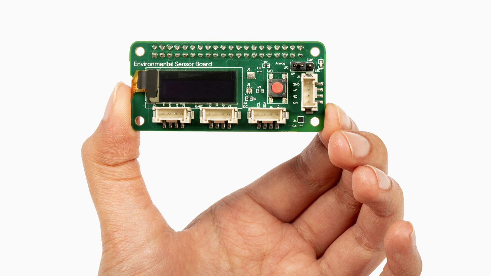

# Smartgarden Sensors

You will need:
- [Google Coral Environmental Sensor Board](https://coral.ai/products/environmental)
- a compatible device to host the sensor board and InfluxDB. I'm using a Raspberry 3 model B V1.2, but feel free to check out the other [compatible devices](https://coral.ai/products/environmental#compatible-with-coral-and-raspberry-pi-boards).

## Setup Coral Environmental Sensor Board



Simply attach the Environmental Sensor Board to 40-pin header on the Raspberry Pi. 
You can now power the Raspberry Pi and it will automatically apply the device tree and configure the header pins.

Now install the needed libraries and driver - from your Raspberry Pi:

```
echo "deb https://packages.cloud.google.com/apt coral-cloud-stable main" | sudo tee /etc/apt/sources.list.d/coral-cloud.list

curl https://packages.cloud.google.com/apt/doc/apt-key.gpg | sudo apt-key add -

sudo apt update

sudo apt upgrade

sudo apt install python3-coral-enviro
```

Reboot the Raspberry Pi with `sudo reboot now` to allow the changes to be applied.

You can use a demo script from Google Coral to check if everything works - [demo](https://coral.ai/docs/enviro-board/get-started/#3-try-the-demo).

## Setup InfluxDB

```
sudo apt update
sudo apt upgrade

# add the InfluxDB repository key:
wget -qO- https://repos.influxdata.com/influxdb.key | sudo apt-key add -
```

Now add the repository for your Raspian flavour:
```
# for buster run
echo "deb https://repos.influxdata.com/debian buster stable" | sudo tee /etc/apt/sources.list.d/influxdb.list
```

Then install and start InfluxDB
```
sudo apt update
sudo apt install influxdb
# start at boot
sudo systemctl unmask influxdb
sudo systemctl enable influxdb
# start the InfluxDB service
sudo systemctl start influxdb
```

Now configure a database, start the InfluxDB shell by typing `influx`:
```
# from the InfluxDB shell
CREATE DATABASE smartgarden
USE smartgarden
```

## Run the Smartgarden Sensors
Clone this repository [smartgarden-sensors](https://github.com/lucaired/smartgarden-sensors).

Setup virtual environment and install dependencies:
```
python3 -m pip install --user --upgrade pip
python3 -m venv env
source env/bin/activate
python3 -m pip install -r requirements.txt
```

Now you can run the script to collect the sensor data:
```
python3 enviro-board.py
```

You can enter the InfluxDB shell, type `USE smartgarden` and 
- `SHOW MEASUREMENTS` to see the various sensors included in the Google Coral Environmental Sensor Board
- `SELECT * FROM <MEASUREMENT>;` to query a specific measurement

Make sure to check out the [Influx Query Language (InfluxQL)](https://docs.influxdata.com/influxdb/v1.8/query_language/) for more insights.


